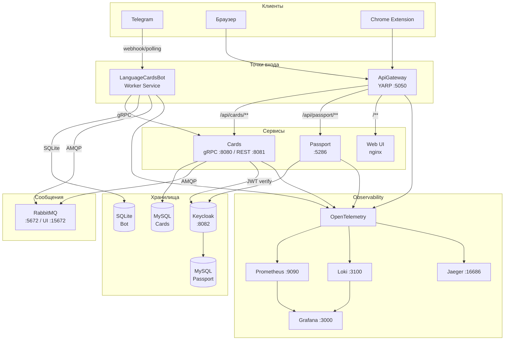

# LanguageCardsBot


Telegram-бот и веб-приложение для изучения иностранных слов методом интервальных повторений. Построено на микросервисной архитектуре: .NET 10 на бэкенде, Vue 3 SPA на фронтенде, полный стек наблюдаемости из коробки.

---

## Архитектура



---

## Сервисы

| Сервис | Роль | Транспорт | Порт(ы) | Хранилище |
|---|---|---|---|---|
| **ApiGateway** | YARP reverse proxy — единая точка входа для HTTP-трафика | HTTP | 5050 | — |
| **Cards** | DDD-микросервис: хранение карточек, интервальные повторения, импорт, статистика | gRPC + REST | 8080 / 8081 | MySQL |
| **Passport** | Управление пользователями и аутентификация через Keycloak | REST | 5286 | Keycloak → MySQL |
| **LanguageCardsBot** | Telegram bot worker — интерфейс для пользователей в мессенджере | Polling/Webhook | — | SQLite |
| **Web UI** | Vue 3 SPA, раздаётся через nginx за YARP | HTTP (через GW) | — | — |
| **Chrome Extension** | Браузерное расширение для быстрого добавления слов | — | — | — |

## Технологический стек

### Backend
| Категория | Технология |
|---|---|
| Runtime | .NET 10, ASP.NET Core |
| Межсервисный транспорт | gRPC (Grpc.AspNetCore 2.64) |
| Reverse proxy | YARP 2.3 |
| ORM | Entity Framework Core 9 + Pomelo (MySQL) |
| Аутентификация | Keycloak 26 + Keycloak.AuthServices 3.0 + JWT Bearer |
| Асинхронные события | MassTransit 8.3 + RabbitMQ |
| Документация API | Scalar, NSwag, Swashbuckle |
| Маппинг | Mapster 10 |
| Telegram | Telegram.Bot 22.7 |

### Frontend
| Категория | Технология |
|---|---|
| Фреймворк | Vue 3 (script setup + Composition API) |
| Сборка | Vite 8, TypeScript 6 |
| Роутинг | Vue Router 5 |
| Store | Pinia 4 |
| Сервер | nginx:alpine |

### Observability
| Инструмент | Назначение | Порт |
|---|---|---|
| OpenTelemetry | Сбор трейсов, метрик и логов | — |
| Prometheus | Хранение метрик | 9090 |
| Grafana | Дашборды | 3000 |
| Loki + Promtail | Агрегация логов (из Docker-контейнеров) | 3100 |
| Jaeger | Распределённая трассировка | 16686 |
| Node Exporter | Метрики хоста | 9100 |
| MySQL Exporter ×2 | Метрики БД Cards и Passport | 9104 / 9105 |

### Инфраструктура
- **Docker Compose** — оркестрация всего стека через единый `docker-compose.yml`
- **GitHub Packages** — NuGet-фид для внутренних контрактов
- **Central Package Management** — все версии NuGet-пакетов централизованы в `Directory.Packages.props`
- **Proto-контракты** — gRPC-схемы публикуются как NuGet-пакет `Contracts.Cards`

---

## Требования

- **Docker** + Docker Compose v2.20+
- **Telegram Bot Token** (от [@BotFather](https://t.me/BotFather))
- Для локальной разработки: **.NET 10 SDK**, **Node.js 22+**

---

## Быстрый старт

### 1. Создать внешние Docker-сети (один раз)

```bash
docker network create language-cards-shared
docker network create passport
docker network create infra
```

### 2. Настроить переменные окружения

```bash
cp src/LanguageCardsBot/LanguageCardsBot.Presentation/LanguageCardsBot.Presentation/.env.example \
   src/LanguageCardsBot/LanguageCardsBot.Presentation/LanguageCardsBot.Presentation/.env
```

Открыть `.env` и заполнить `BOT_TOKEN` токеном от BotFather.

### 3. Запустить весь стек

```bash
docker compose up --build
```

### 4. Что доступно

| Сервис | URL |
|---|---|
| Веб-приложение / API Gateway | http://localhost:5050 |
| Swagger (Cards REST) | http://localhost:8081/swagger |
| Keycloak Admin | http://localhost:8082 (admin / admin) |
| Grafana | http://localhost:3000 (admin / admin) |
| Jaeger UI | http://localhost:16686 |
| Prometheus | http://localhost:9090 |
| RabbitMQ Management | http://localhost:15672 |

---

## Локальная разработка

### .NET solution

```bash
# Сборка всех проектов
dotnet build LanguageCardsBot.sln
```

### Web SPA

```bash
cd apps/web
npm install
npm run dev   # dev-сервер на :5173, проксирует API на :5050
```

### Chrome Extension

1. Открыть `chrome://extensions/`
2. Включить **Режим разработчика**
3. **Загрузить распакованное расширение** → выбрать папку `apps/chrome-extension/`

### Contracts / NuGet

Внутренние контракты (`Contracts.Cards`, `Contracts.Passport`, `Contracts.Messaging` и др.) публикуются на **GitHub Packages**.

Для работы с пакетами необходим `GITHUB_TOKEN` с правом `read:packages`:

```bash
# nuget.config уже настроен на GitHub Packages
# Установить переменную для docker compose
export GITHUB_TOKEN=ghp_...
```

Чтобы упаковать и опубликовать изменённый контракт:

```bash
cd src/Contracts/Contracts.Cards
dotnet pack -c Release
dotnet nuget push bin/Release/*.nupkg \
  --source "github" \
  --api-key $GITHUB_TOKEN
```

### gRPC: подключение контрактов

Контракты поставляются как NuGet-пакет с `.proto`-файлами. При ссылке на пакет нужно указать тип генерации:

```xml
<!-- Серверный стаб (Cards.Presentation) -->
<PropertyGroup>
  <LanguageCardsBotGrpcServices>Server</LanguageCardsBotGrpcServices>
</PropertyGroup>

<!-- Клиентский стаб (LanguageCardsBot, ApiGateway) -->
<PropertyGroup>
  <LanguageCardsBotGrpcServices>Client</LanguageCardsBotGrpcServices>
</PropertyGroup>
```

---

## Структура репозитория

```
LanguageCardsBot/
├── src/
│   ├── ApiGateway/          # YARP reverse proxy
│   ├── Cards/               # DDD-микросервис карточек
│   │   ├── Cards.Domain/
│   │   ├── Cards.Application/
│   │   ├── Cards.Infrastructure/
│   │   ├── Cards.Presentation/   # gRPC + REST, Dockerfile
│   │   └── Cards.Contracts.Rest/ # DTO для REST API
│   ├── Contracts/           # NuGet-пакеты с контрактами
│   │   ├── Contracts.Cards/      # .proto файлы (gRPC v3)
│   │   ├── Contracts.Common/     # Общие enum и исключения
│   │   ├── Contracts.Messaging/  # События RabbitMQ
│   │   ├── Contracts.Passport/   # OpenAPI-спецификация Passport
│   │   └── Contracts.Observability/
│   ├── Passport/            # Identity-сервис (Keycloak)
│   │   └── keycloak/realms/ # Предзагруженный realm
│   └── LanguageCardsBot/    # Telegram bot worker
├── apps/
│   ├── web/                 # Vue 3 SPA (Feature-Sliced Design)
│   └── chrome-extension/    # Браузерное расширение
├── infra/
│   ├── docker-compose.infra.yml  # Observability-стек
│   ├── prometheus/
│   ├── exporters/           # Конфиги MySQL Exporter
│   └── rabbitmq/
├── docs/
│   └── superpowers/specs/   # Архитектурные решения
├── docker-compose.yml       # Корневой compose (include всех сервисов)
└── Directory.Packages.props # Централизованные версии NuGet
```
